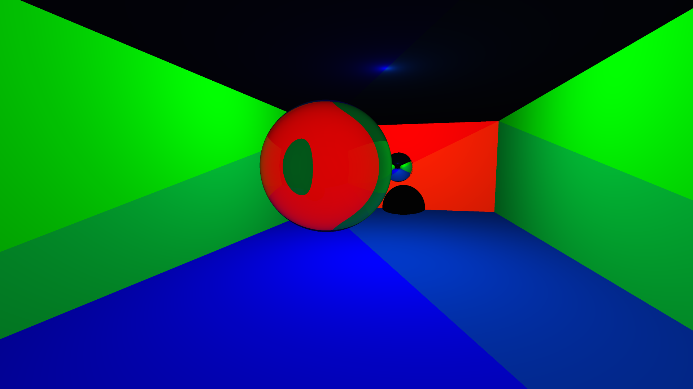

# Raytracing_GPU
Raytracer running with OpenCL on the GPU, allowing fluid movement through the scene. 
For each frame, the GPU has to track over eight million rays (even when leaving out refractions and reflections). 
Despite this enormous effort, it runs at 40 to 80 fps on an Intel A370M graphics card.

